# FLUTTER APP FINAL GRUPO 15 - LABORATORIO IV
# DOCUMENTACION

## 1 PONIN ERIC 21889 - API DE CLIENTES - 

### 1. **Detalle del Cliente**

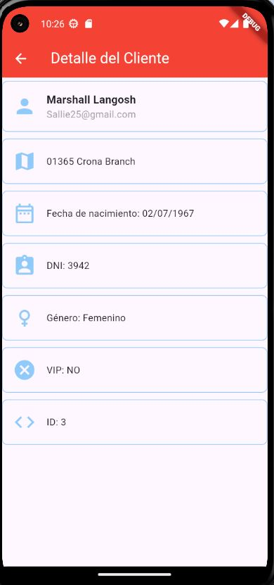

   **Contenido:**
   - La pantalla muestra información detallada de un cliente específico:
     - Nombre: *Nombre Apellido*.
     - Dirección: *Calle False 123*.
     - Fecha de nacimiento: *01/01/2000*.
     - DNI: *00000000*.
     - Género: *Male*.
     - Estado VIP: *True*.

   **Función:**
   - Esta vista es utilizada para mostrar los datos completos de un cliente seleccionado desde una lista previa. Es útil para consultar información específica y detallada.

---
### 2. **Lista de Clientes**

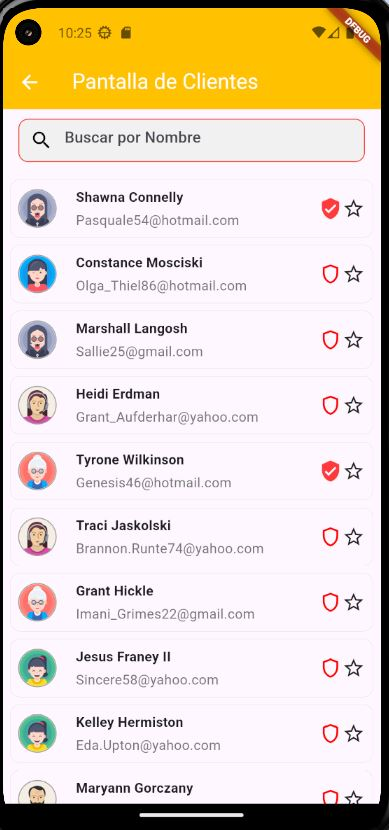

   **Contenido:**
   - La pantalla presenta una lista de clientes con un campo de búsqueda para filtrar por nombre.
   - En este caso como la API no proporciona imagenes se cargaron avatars de forma local y carga de manera aleatoria segun el genero una imagen para los clientes..
   - Cada cliente en la lista muestra: Nombre completo y correo electronico.
   - Muestra un escudo pintado con un tilde si el cliente es VIP.
   -Y un boton para marcarle una estrella.

   **Función:**
   - Es una vista principal para navegar entre los clientes registrados en la aplicación.
   - El campo de búsqueda permite al usuario encontrar un cliente rápidamente escribiendo su nombre.
   -Al hacer click en el cliente se puede ver mas informacion de el.

---
### 3. **Pantalla Principal**

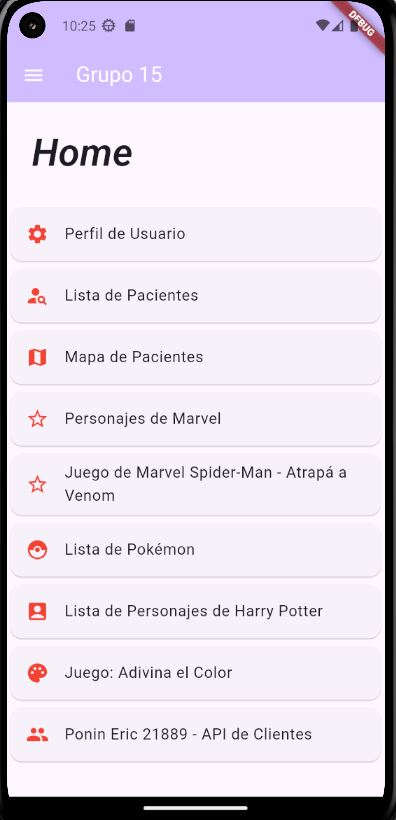

   **Contenido:**
   - Es la vista de menú o página principal que ofrece múltiples opciones:
     - *Perfil de Usuario*.
     - *Lista de Clientes*.

   **Función:**
   - Actúa como el hub principal desde donde se puede navegar a otras funcionalidades de la aplicación.

## 2 Documentación API de Harry Potter – Losada María Eugenia 21787

API URL: https://tup-labo-4-grupo-15.onrender.com/api/v1/todoslospersonajes
Emulador Usado: Pixel 4 API 34

---

Esta parte de la aplicación está dedicada a los personajes de la saga Harry Potter. La aplicación permite ver una lista de personajes, elegir un personaje o buscar uno en la barra de búsqueda, y así obtener más detalles del mismo, e incluso jugar un mini-juego para adivinar los colores de las casas de Hogwarts.

---

### 1. Listado de Personajes
   Descripción:
      •	Presenta una lista de personajes con su nombre, casa y actor, además de una imagen y un fondo degradado según la casa de Hogwarts.

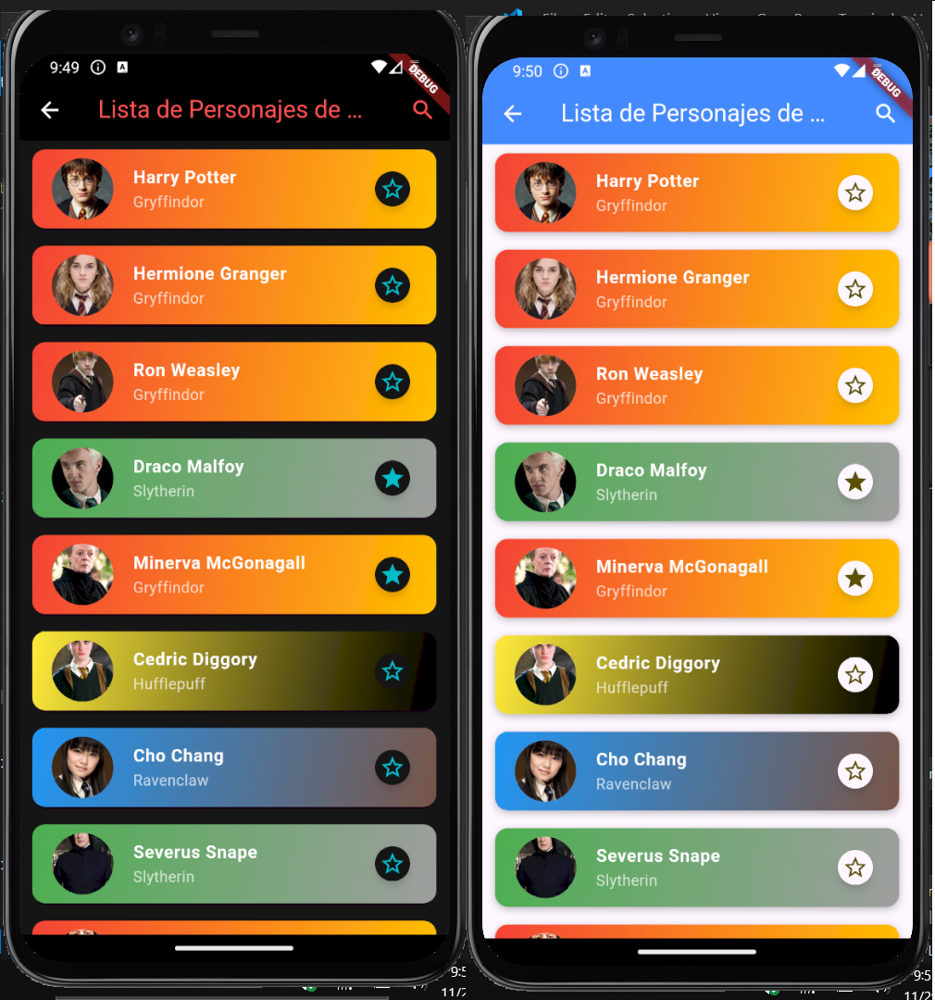

      •	Sistema de búsqueda interactivo utilizando SearchDelegate, que optimiza las consultas a la API mediante un temporizador para evitar peticiones excesivas.

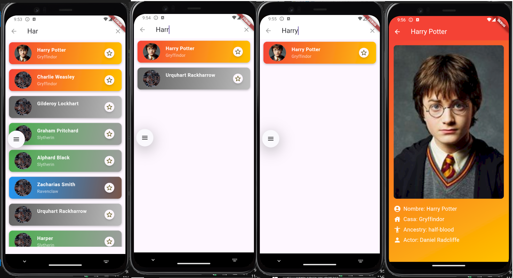

   Función:
      •	Facilita la búsqueda y selección de personajes, mostrando resultados rápidos y precisos.

---

### 2. Detalle del Personaje

   Descripción:
      •	Muestra detalles específicos del personaje seleccionado, como:

         o	Nombre.
         o	Casa de Hogwarts.
         o	Actor que lo interpreta.
         o	Linaje (sangre pura, mestizo, muggle, etc.).

      •	Fondo degradado que varía según la casa, con una opción gris para personajes sin casa y una imagen predeterminada para aquellos sin foto disponible.

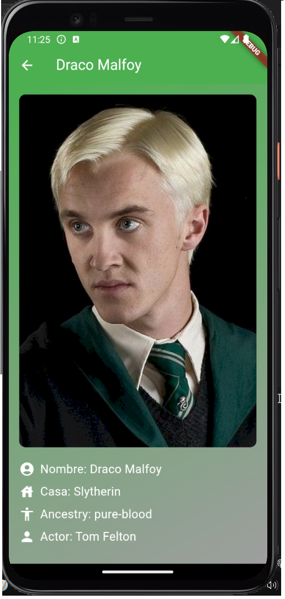

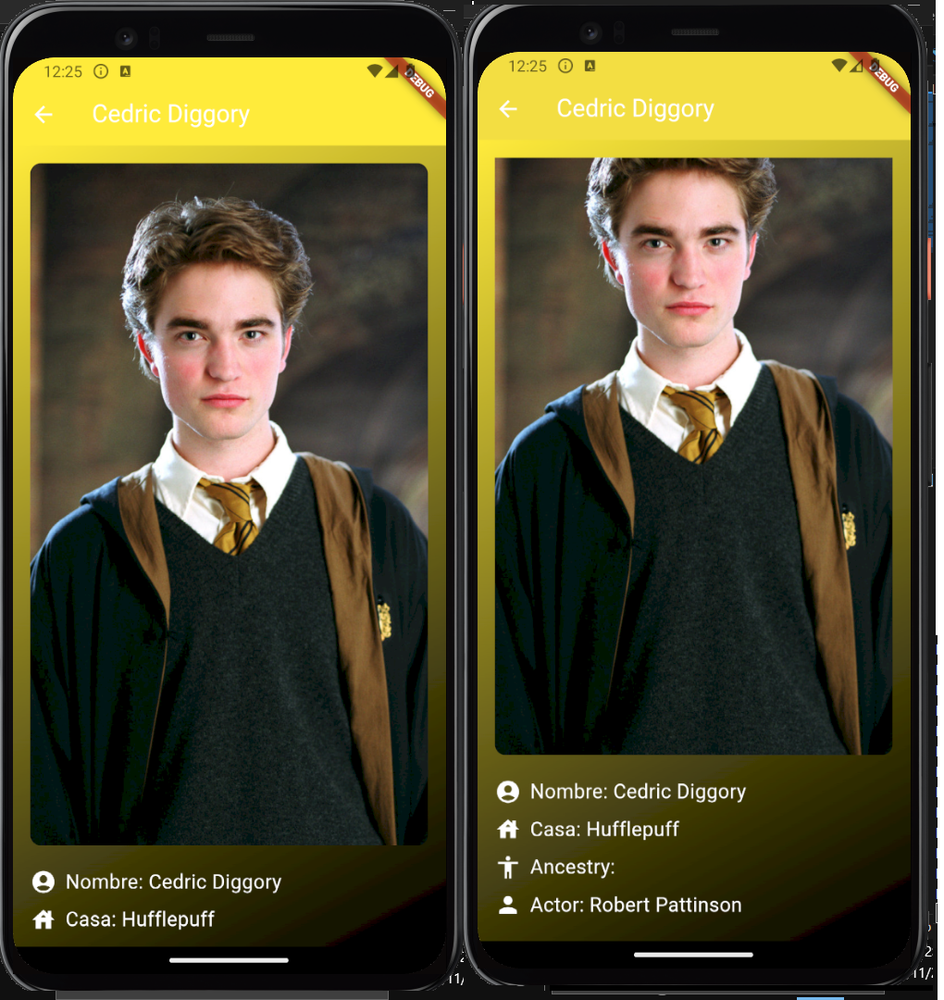

   Función:
      •	Proporciona información detallada y visualmente atractiva sobre los personajes seleccionados.

---

### 3. Mini-Juego: Adivina el Color de la Casa

   Descripción:
      •	Juego interactivo donde el usuario debe adivinar el color de una casa de Hogwarts.
      •	Retroalimentación visual inmediata que indica si la elección fue correcta o incorrecta.
      •	Muestra una imagen representativa de la casa tras cada intento.

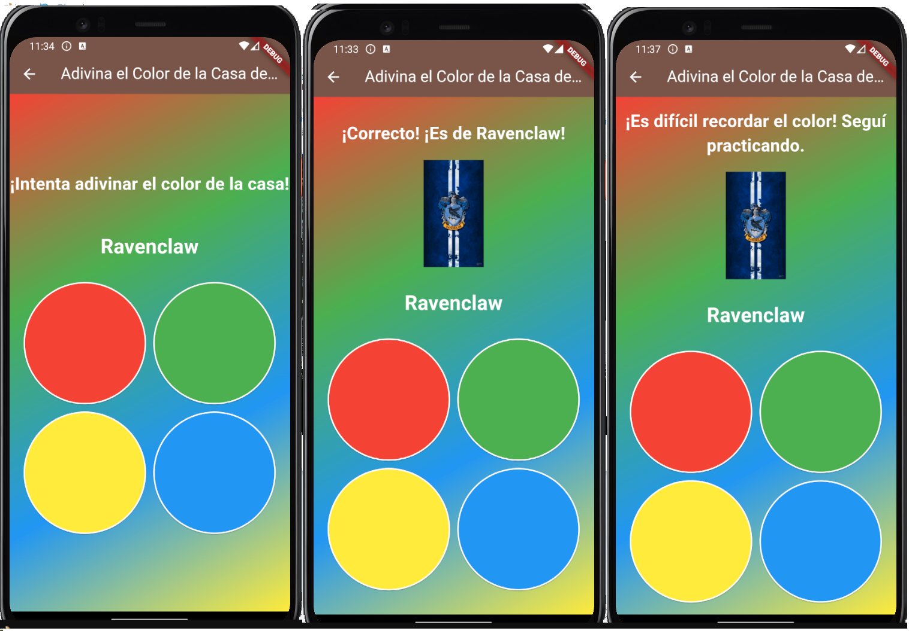

   Función:
      •	Ayuda a aprender los colores de las casas de forma divertida y didáctica. Es una herramienta educativa para familiarizarse con los colores de cada casa.

---

### Rutas Configuradas
   1.	Lista de Personajes: /harryPotterList
   2.	Detalles del Personaje: /harryPotterInfo
   3.	Juego: Adivina el Color: /harryPotter/guessColor

---

### Widgets Reutilizables
   1.	HarryPotterCard: Muestra un resumen del personaje con un fondo degradado que corresponde a su casa.
   2.	HarryPotterItem: Elemento de lista que representa al personaje, mostrando nombre, imagen y casa.
   3.	AdivinaElColor: Implementación del juego interactivo para adivinar el color de la casa de Hogwarts.
   4.	DrawerMenu: Menú lateral que facilita la navegación entre pantallas.
   5.	FutureFetcher: Maneja peticiones HTTP para obtener datos y renderizar widgets dinámicamente.
---

### Barrel Files Usados

   Para organizar el código, use barrel files para agrupar las exportaciones de clases y widgets. Estos son algunos ejemplos:

      1.	lib/classes/classes.dart
            export 'HarryPotterCharacters.dart';
            export 'HarryPotterInfoPageArguments.dart';

      2.	lib/widgets/harry_potter/harry_potter_widgets.dart
            export 'HarryPotterCard.dart';
            export 'HarryPotterDescription.dart';
            export 'HarryPotterItem.dart';
            export 'HarryPotterList.dart';
            export 'AdivinaElColor.dart';

      3.	lib/pages/harry_potter/harry_potter_screens.dart
            export 'HarryPotterListPage.dart';
            export 'HarryPotterInfoPage.dart';

---

### Detalles Técnicos
      •	Emulador Usado: Pixel 4 API 34.
      •	Persistencia de Datos: SharedPreferences para almacenar preferencias como tema oscuro y personajes favoritos.
      •	Gestión de Estado: Provider para cambiar entre tema claro y oscuro.
      •	Peticiones HTTP: Uso de FutureBuilder para gestionar solicitudes a la API.

## 3 Documentacion de la API de Marvel - Chaparro Juan Jose Leg. 21737

API URL Utilizadas: 

Para la lista, paginado y búsqueda: "https://tup-labo-4-grupo-15.onrender.com/api/v1/marvel/chars?nameStartsWith=$query&limit=$_limit&offset=$offset";

Para mostrar los detalles de cada personaje: "https://tup-labo-4-grupo-15.onrender.com/api/v1/marvel/chars/${character.id}"

En esta parte de la aplicacion se muestra una lista de personajes de marvel, se puede buscar por nombre, y se puede ver los detalles de cada personaje.

### 1. Detalles Técnicos.

•	Emulador Usado: Pixel 7 API 33, resolución 1080x2400.
•	Persistencia de Datos: SharedPreferences para almacenar preferencias como tema oscuro y personajes favoritos.
•	Gestión de Estado: Provider para cambiar entre tema claro y oscuro.
•	Peticiones HTTP: Uso de FutureBuilder para gestionar solicitudes a la API.
•	Font personalizada: "assets/fonts/Marvel.ttf" extraida de la pagina https://www.dafont.com/es/marvel.font.

### 2. Lista de Personajes.

   Descripción:

      •	Lista de personajes de Marvel con su imagen, nombre y estrella que marca favoritos, cada item que se carga proviene de una card rehutilizable "CustomCardMarvelChars.dart".

   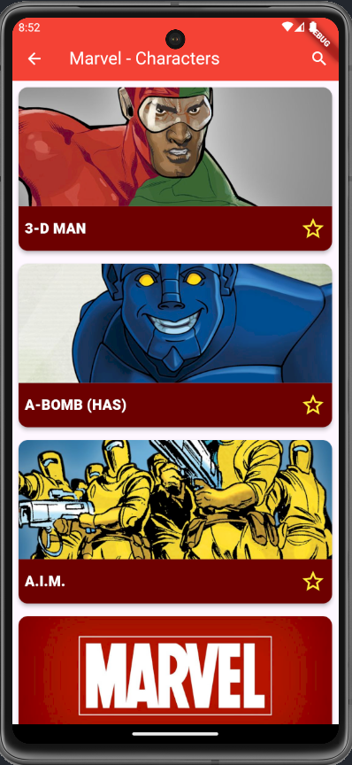

      •	Sistema de búsqueda utilizando SearchDelegate, que optimiza las consultas a la API mediante un temporizador.

   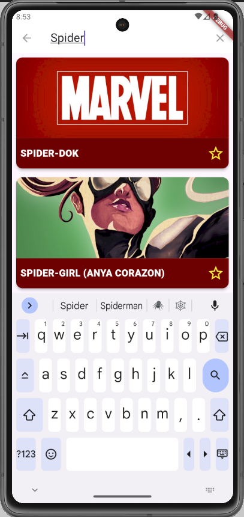

### 3. Detalle del Personaje.

   Descripción:

      •	Pantalla que muestra la descripcion del personaje:
         o	Nombre y estrella para agregar o quitar de favoritos.
         o	Imagen.
         o	Descripcion.
         o	Series en las que aparece.

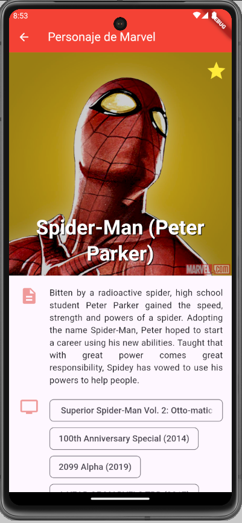

      •	Para que el nombre me quede en la parte superior utilize un SilverAppBar, y para que el resto de la informacion quede debajo de la barra de navegacion utilice un SingleChildListDelegate.

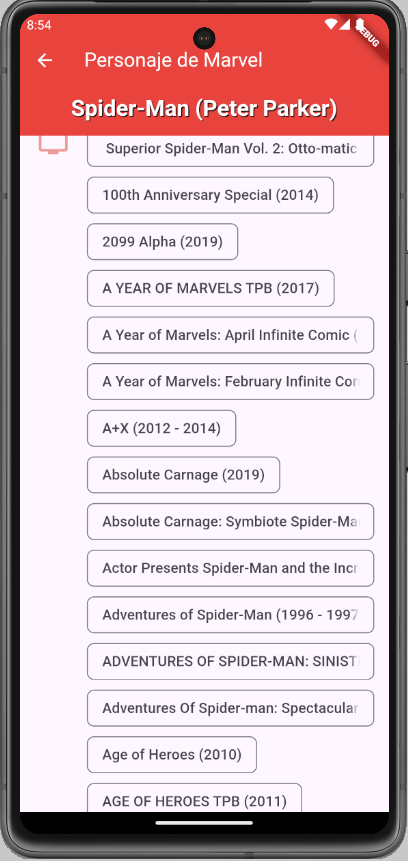

### 4. Mini-Juego: Spider-Man: Atrapa a Venom!.

   Descripción: Moverse de un lado al otro atrapando  a Venom.

   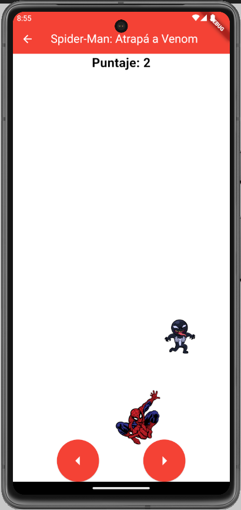

### 5. Widgets Reutilizables utilizados:

a.	CustomCardMarvelChars.

b.	DrawerMenu.

c.	FutureFetcher.